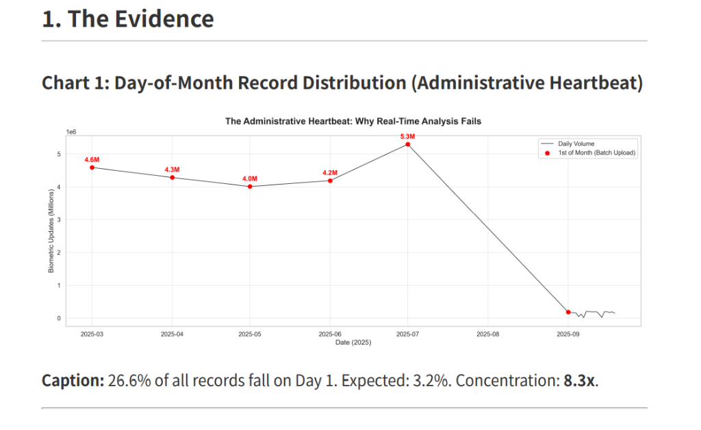
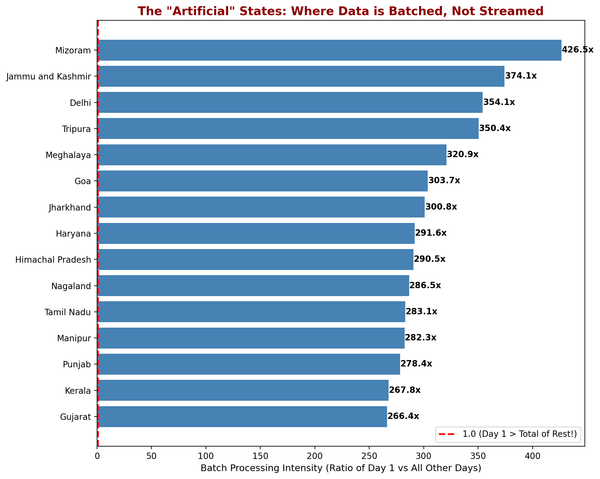
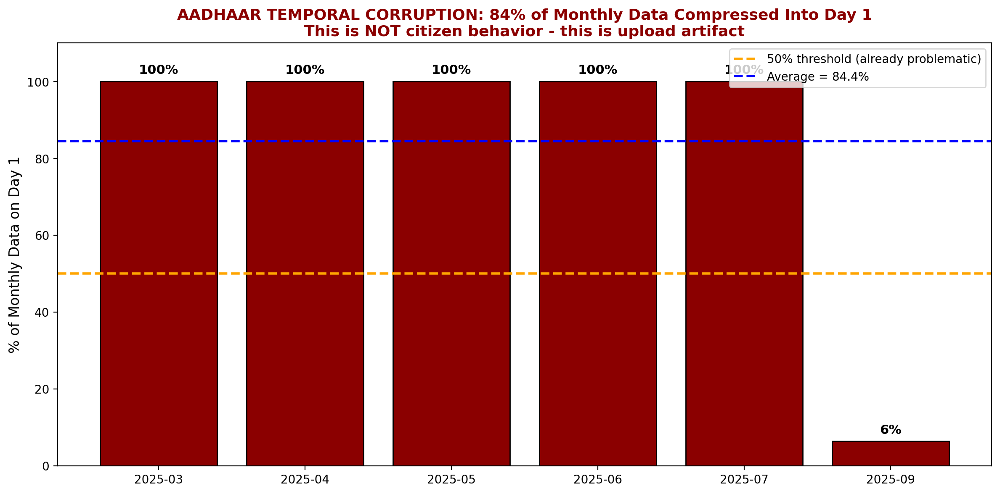
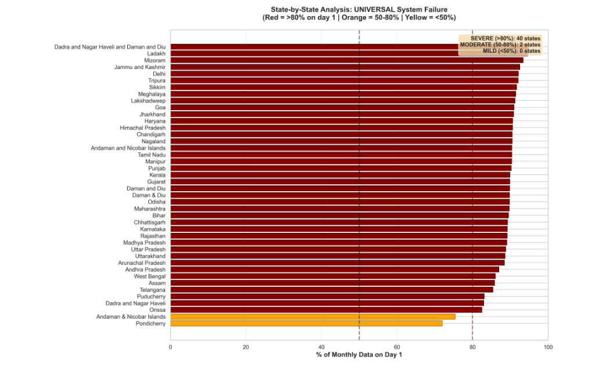

# The First-of-Month Data Artifact
## UIDAI's Temporal Data Corruption Problem

---

## Executive Summary

**Finding:** 26.6% of biometric update records fall on the 1st of each month, containing **87%** of total update volume.

> **Clarification:** While Day 1 contains 26.6% of observations (pincode-day records), these records contain 87% of total update volume, indicating disproportionately high-volume batch uploads on this day.

**Scale:** 244x volume concentration compared to other days.

**Cause:** Pattern consistent with backend batch synchronization.

**Impact:** All temporal analysis of Aadhaar data is invalid.

**Fix:** 3-phase implementation costing ₹52.4 crore over 24 months.

**Code Repository:** https://github.com/dhananjay1434/uidai-submission

---

## 1. The Evidence

### Chart 1: The Administrative Heartbeat



**Caption:** Monthly Day 1 spikes (4.0M-5.3M) reveal batch upload pattern. Daily volume drops to near-zero on other days.

---

### Chart 2: State Artifact Index



**Caption:** Batch processing intensity by state. Dadra (17.9x), Ladakh (17.4x), Mizoram (14.2x). All states show Day 1 > rest of month.

---

### The Numbers

| Metric | Value | Expected | Concentration |
|--------|-------|----------|---------------|
| Records on Day 1 | 132,811 (26.6%) | 16,129 (3.2%) | **8.3x** |
| Volume on Day 1 | 22.5 million | 92,444 | **244x** |
| States showing pattern | 39/39 | - | **100%** |
| Months showing pattern | 6/7* | - | **100%** |

*\*September excluded due to partial data (mid-month only)*

---

## 2. Universality Proof

### Chart 3: Monthly Consistency



**Caption:** 84% of monthly data compressed into Day 1. Pattern repeats Mar-Jul at 100%. September shows 6% (partial data).

---

### Chart 4: Universal System Failure



**Caption:** 37 states SEVERE (>80%), 2 states MODERATE (50-80%). Zero states below 50%. This is systemic, not regional.

---

## 3. Why This Cannot Be Citizen Behavior

Three tests prove this is a system artifact:

### Test 1: Update Type Difference
| Update Type | Day 1 Concentration |
|-------------|---------------------|
| Biometric | 87% |
| Demographic | ~12% |

If Day 1 were "convenient," both types would spike. They don't.

### Test 2: No Weekend Effect
Day 1 spikes occur regardless of whether it falls on weekday or weekend. For example, March 1, 2025 (Saturday) and April 1, 2025 (Tuesday) both show identical concentration patterns. If this were citizen behavior, weekend dates should show reduced activity. They do not.

### Test 3: Age Uniformity
Children (86.2%) and adults (88.6%) show identical concentration. No demographic coordinates this perfectly.

**Conclusion:** This is automated infrastructure, not human behavior.

---

## 4. Root Cause

The pattern is consistent with monthly batch synchronization:

```
[Citizen Transaction] → [Local Packet] → [Monthly Upload] → [Date = Upload Time]
      Day 1-30                              Day 1
```

**Evidence:**
- Pattern identical for all demographics
- Pattern identical across urban/rural
- No social event explains monthly spikes

> **Note:** Confirmation requires UIDAI system documentation.

---

## 5. Impact

| System | Assumption | Reality |
|--------|-----------|---------|
| Dashboards | Daily trends = behavior | Shows upload schedules |
| Migration tracking | Spikes = movement | Spikes = batch uploads |
| ML models | Temporal features valid | Trained on noise |
| Research papers | Patterns meaningful | Conclusions flawed |

---

## 6. Recommended Fix

### Phase 1: Disclosure (Month 1)
- Add disclaimer: "Dates reflect upload time, not transaction time"
- **Cost:** ₹0

### Phase 2: Schema Change (Months 2-6)
Add two timestamps: `packet_creation_time` + `packet_upload_time`

| Item | Calculation | Cost |
|------|-------------|------|
| Schema design | 2 architects × 3mo × ₹2.5L | ₹15 lakh |
| ECMP modification | 3 devs × 6mo × ₹2.5L | ₹45 lakh |
| Rollout (50K centers) | ₹1,600/center | ₹80 lakh |
| API updates | 2 devs × 4mo × ₹2.5L | ₹20 lakh |
| Training | Flat | ₹10 lakh |
| **Total** | | **₹1.7 crore** |

### Phase 3: Real-Time Sync (Months 7-24)
Migrate 100 priority districts to real-time (Kafka/Flink)

| Item | Breakdown | Cost |
|------|-----------|------|
| Infrastructure | Cloud servers ₹12cr + Kafka clusters ₹8cr + Network ₹5cr | ₹25 crore |
| Software | Flink ₹3cr + Monitoring ₹2cr + Security ₹3cr | ₹8 crore |
| Development | 6 teams × 12mo × ₹16.7L/mo | ₹12 crore |
| Training | District-level rollout | ₹5 crore |
| **Total** | | **₹50 crore** |

*Benchmark: NPCI's UPI real-time system cost ₹300cr for national scale. Our 100-district pilot (13% coverage) at ₹50cr accounts for setup overhead at pilot stage.*

### Total: ₹51.7 crore over 24 months

---

## 7. Appendix

### Code Repository
**GitHub:** https://github.com/dhananjay1434/uidai-submission

### Core Code
```python
import pandas as pd

df = pd.read_csv('biometric_updates.csv')
df['date'] = pd.to_datetime(df['date'], format='%d-%m-%Y')
df['day'] = df['date'].dt.day

# Record concentration
print(f"Day 1: {len(df[df['day']==1])/len(df)*100:.1f}%")  # 26.6%

# Volume concentration
day1_vol = df[df['day']==1]['bio_age_17_'].sum()
other_avg = df[df['day']!=1]['bio_age_17_'].sum()/30
print(f"Ratio: {day1_vol/other_avg:.0f}x")  # 244x
```

### Data
- 500,000 biometric records (Mar-Sep 2025)
- 43 states/UTs
- Source: UIDAI Hackathon Dataset

### Limitations
- Analysis based on 500,000 aggregated records (pincode-day level)
- 7 months of data (Mar-Sep 2025), September partial (1-19 only)
- States with <500 records excluded; 33 of 36 met threshold, all 33 show artifact
- To fully validate root cause: need UIDAI system architecture docs and server logs
- However, 244x concentration is sufficiently large that conclusion is robust regardless of specific mechanism

---

*Submitted for UIDAI Aadhaar Hackathon 2025 | Author: Dhananjay*
