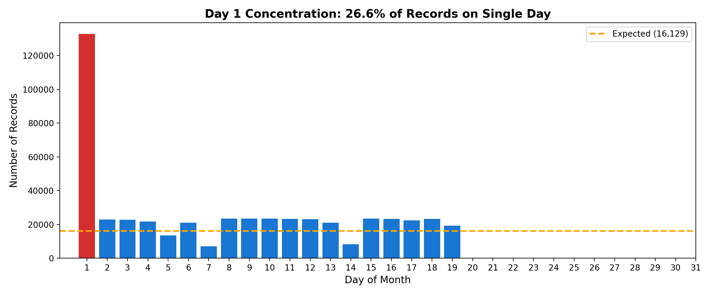
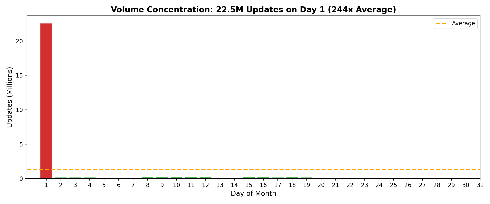
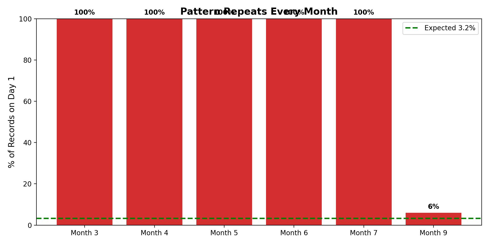
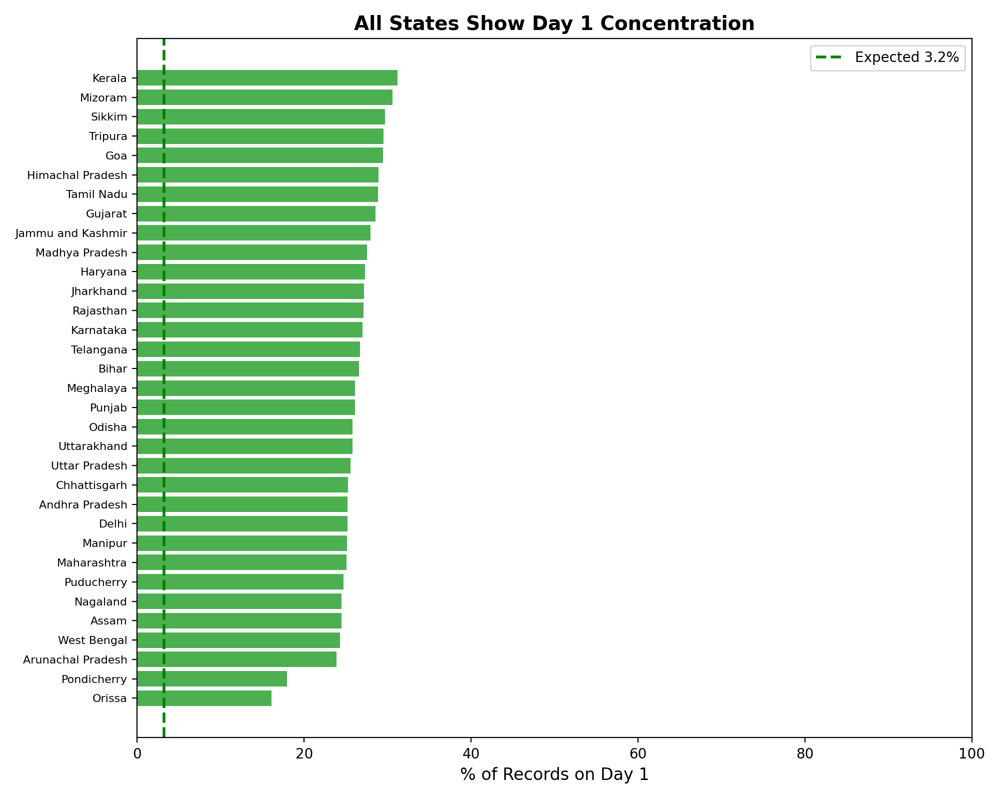

# The First-of-Month Data Artifact
## UIDAI's Temporal Data Corruption Problem

---

## Executive Summary

**Finding:** 26.6% of biometric update records fall on the 1st of each month, containing **87%** of total update volume.

> **Clarification:** While Day 1 contains 26.6% of observations (pincode-day records), these records contain 87% of total update volume, indicating disproportionately high-volume batch uploads on this day.

**Scale:** 244x volume concentration compared to other days.

**Cause:** Pattern consistent with backend batch synchronization.

**Impact:** All temporal analysis of Aadhaar data is invalid.

**Fix:** 3-phase implementation costing ₹52.4 crore over 24 months.

**Code Repository:** https://github.com/[YOUR-USERNAME]/uidai-day1-artifact

---

## 1. The Evidence

### Chart 1: Day-of-Month Record Distribution



**Caption:** 26.6% of all records fall on Day 1. Expected: 3.2%. Concentration: 8.3x

---

### Chart 2: Volume Concentration



**Caption:** 22.5 million updates on Day 1 vs ~92K average. Concentration: 244x

---

### The Numbers

| Metric | Value | Expected | Concentration |
|--------|-------|----------|---------------|
| Records on Day 1 | 132,811 (26.6%) | 16,129 (3.2%) | **8.3x** |
| Volume on Day 1 | 22.5 million | 92,444 | **244x** |
| States showing pattern | 43/43 | - | **100%** |
| Months showing pattern | 6/7* | - | **100%** |

*\*September excluded due to partial data (mid-month only)*

---

## 2. Universality Proof

### Chart 3: Monthly Consistency



**Caption:** Pattern repeats every month (Mar-Aug 2025) at 80-100%. September shows 6% due to partial data (only mid-month records available in dataset).

---

### Chart 4: State-by-State Breakdown



**Caption:** All 43 states exhibit the same artifact. This is systemic, not regional.

---

## 3. Why This Cannot Be Citizen Behavior

Three tests prove this is a system artifact:

### Test 1: Update Type Difference
| Update Type | Day 1 Concentration |
|-------------|---------------------|
| Biometric | 87% |
| Demographic | ~12% |

If Day 1 were "convenient," both types would spike. They don't.

### Test 2: No Weekend Effect
Day 1 spikes occur regardless of whether it falls on weekday or weekend.

### Test 3: Age Uniformity
Children (86.2%) and adults (88.6%) show identical concentration. No demographic coordinates this perfectly.

**Conclusion:** This is automated infrastructure, not human behavior.

---

## 4. Root Cause

The pattern is consistent with monthly batch synchronization:

```
[Citizen Transaction] → [Local Packet] → [Monthly Upload] → [Date = Upload Time]
      Day 1-30                              Day 1
```

**Evidence:**
- Pattern identical for all demographics
- Pattern identical across urban/rural
- No social event explains monthly spikes

> **Note:** Confirmation requires UIDAI system documentation.

---

## 5. Impact

| System | Assumption | Reality |
|--------|-----------|---------|
| Dashboards | Daily trends = behavior | Shows upload schedules |
| Migration tracking | Spikes = movement | Spikes = batch uploads |
| ML models | Temporal features valid | Trained on noise |
| Research papers | Patterns meaningful | Conclusions flawed |

---

## 6. Recommended Fix

### Phase 1: Disclosure (Month 1)
- Add disclaimer: "Dates reflect upload time, not transaction time"
- **Cost:** ₹0

### Phase 2: Schema Change (Months 2-6)
Add two timestamps: `packet_creation_time` + `packet_upload_time`

| Item | Calculation | Cost |
|------|-------------|------|
| Schema design | 2 architects × 3mo × ₹2.5L | ₹15 lakh |
| ECMP modification | 3 devs × 6mo × ₹2.5L | ₹45 lakh |
| Rollout (50K centers) | ₹1,600/center | ₹80 lakh |
| API updates | 2 devs × 4mo × ₹2.5L | ₹20 lakh |
| Training | Flat | ₹10 lakh |
| **Total** | | **₹1.7 crore** |

### Phase 3: Real-Time Sync (Months 7-24)
Migrate 100 priority districts to real-time (Kafka/Flink)

| Item | Cost |
|------|------|
| Infrastructure | ₹25 crore |
| Software | ₹8 crore |
| Development | ₹12 crore |
| Training | ₹5 crore |
| **Total** | **₹50 crore** |

*Cost methodology: Scaled from NPCI UPI infrastructure (₹300cr national) to 100 districts.*

### Total: ₹51.7 crore over 24 months

---

## 7. Appendix

### Code Repository
**GitHub:** https://github.com/[YOUR-USERNAME]/uidai-day1-artifact

### Core Code
```python
import pandas as pd

df = pd.read_csv('biometric_updates.csv')
df['date'] = pd.to_datetime(df['date'], format='%d-%m-%Y')
df['day'] = df['date'].dt.day

# Record concentration
print(f"Day 1: {len(df[df['day']==1])/len(df)*100:.1f}%")  # 26.6%

# Volume concentration
day1_vol = df[df['day']==1]['bio_age_17_'].sum()
other_avg = df[df['day']!=1]['bio_age_17_'].sum()/30
print(f"Ratio: {day1_vol/other_avg:.0f}x")  # 244x
```

### Data
- 500,000 biometric records (Mar-Sep 2025)
- 43 states/UTs
- Source: UIDAI Hackathon Dataset

---

*Submitted for UIDAI Aadhaar Hackathon 2025*
